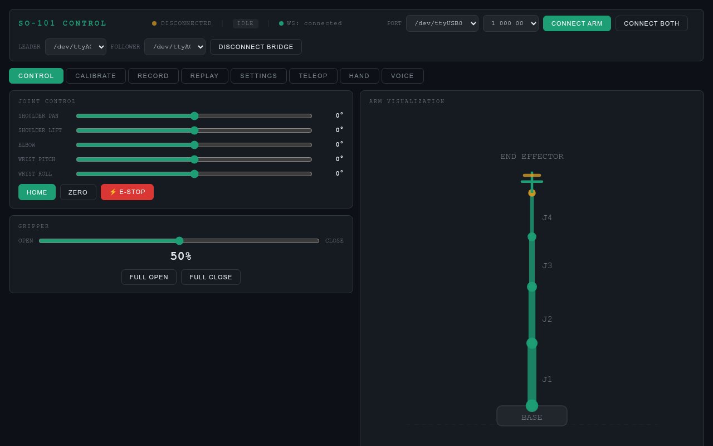

# SO-101 Robotic Arm Bridge

Web GUI + control bridge for the SO-101 robot arm (5-DOF + gripper), running over WebSocket and MJPEG. Works with real hardware or the MuJoCo simulator.

## About

A full-stack control system for the SO-101 arm built on lerobot. Drive joints from the browser, teleoperate with a leader arm, record/replay episodes, or control it with camera-based hand tracking — all from one GUI.



## Features

- **Joint control** — live sliders, kinematics visualization, e-stop, home/zero
- **Dual-arm teleop** — physically move the leader, follower mirrors it (MuJoCo viewer in sim)
- **Hand tracking** — control the arm with your hand via MediaPipe
- **Head tracking** — head pose → joint motion
- **IK mode** — damped least-squares inverse kinematics
- **Voice control** — push-to-talk commands via whisper
- **Record / replay** — LeRobot-compatible episode capture with dual camera streams
- **Calibration** — per-arm wizard for joint limits, gripper, and home position
- **Simulation** — full MuJoCo backend, no hardware required

## Quick start

```bash
python3 -m venv .venv
source .venv/bin/activate
pip install -r requirements.txt
python server.py
```

Simulation mode (no hardware):
```bash
SO101_SIM_MODE=mujoco python server.py
```

Open **http://localhost:8766** in Chrome.

## Hardware

| Device          | Default port  |
|-----------------|---------------|
| Follower arm    | `/dev/ttyACM1` |
| Leader arm      | `/dev/ttyACM0` |

If you get permission errors on the serial port:
```bash
sudo usermod -aG dialout $USER   # then log out and back in
```

## Structure

```
server.py           WebSocket + MJPEG server (entry point)
arm_controller.py   Hardware motor control
sim_backend.py      MuJoCo simulation backend
teleop.py           Leader → follower teleoperation
calibrate_limits.py Joint/gripper calibration
episode_recorder.py Episode recording (LeRobot schema)
hand_tracking.py    MediaPipe hand tracking
head_tracking.py    MediaPipe head tracking
voice_control.py    Push-to-talk voice commands
ik_solver.py        Inverse kinematics solver
mjpeg_server.py     Camera stream server
static/index.html   Browser GUI (self-contained)
config.py/config.json  Settings
```

## Ports

| Port | Protocol  | Purpose                  |
|------|-----------|--------------------------|
| 8765 | WebSocket | GUI ↔ bridge control     |
| 8766 | HTTP/MJPEG| GUI page + camera streams |
